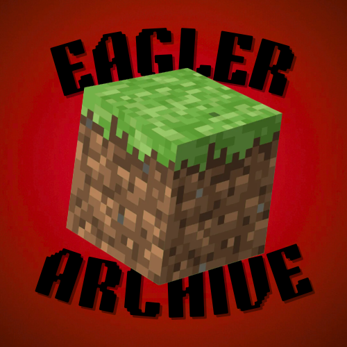

<div align="center">
  <br />
  
  <br />
  <br />
  <p><em>A centralized archive for Eaglercraft client builds.</em></p>
  <br />

  <a href="#"></a>
  &nbsp;
  <a href="#"></a>
  &nbsp;
  <a href="#license"></a>

  <br />
  <br />

  
  &nbsp;
  

  <br />
  <br />
  <br />
</div>

---

<br />

<div align="center">

<table>
<tr>
<td align="center" width="200">


**Archive**

Browse a clean, organized library of Eaglercraft client builds across every category.

</td>
<td align="center" width="200">


**Download**

Every entry ships with direct download links and mirror fallbacks.

</td>
<td align="center" width="200">


**Search**

Instantly filter by name, version, tag, or category to find exactly what you need.

</td>
</tr>
</table>

</div>

<br />

---

## &nbsp;&nbsp; About

**Eagler Archive** is a centralized archive for Eaglercraft client builds. It provides a clean, organized space to browse and discover Eaglercraft clients — including hacked clients, vanilla builds, utility mods, and more.

Every entry includes a full description, version history, download links, screenshots, and a changelog, making it easy to find exactly what you're looking for.

<br />

---

## &nbsp;&nbsp; What's Included

- Full client descriptions and version history
- Download links with mirror support
- Screenshot galleries
- Per-entry changelogs
- Tag and category filtering
- View and download counters

<br />

---

## &nbsp;&nbsp; License

```
Copyright © 2026 EaglerArchive (Kogem and CandyCaneEdits). All Rights Reserved.

All rights, title, and interest in and to the code, content, documentation, and assets
contained within this repository, including the website EaglerArchive, created on
March 8, 2026, are the exclusive property of the owners, EaglerArchive (Kogem and
CandyCaneEdits). This repository and its contents are protected under international
copyright laws, intellectual property rights, and all applicable legal frameworks.

No part of this repository may be copied, reproduced, modified, translated, distributed,
published, transmitted, sublicensed, or used in any form, whether in whole or in part,
for commercial or non-commercial purposes, without the express prior written permission
of the owners.

Any unauthorized access, use, duplication, redistribution, or creation of derivative works
from this repository is strictly prohibited and may result in legal action. By accessing
or using this repository, you acknowledge and agree to respect these terms and recognize
the full ownership rights of the owners.

This statement serves as a formal notice that all intellectual property contained herein
remains under the sole control of EaglerArchive (Kogem and CandyCaneEdits) and may not
be exploited, copied, or utilized in any manner without explicit authorization.
```

<br />

---

<div align="center">
  <br />
  
  &nbsp;
  <sub>© 2026 EaglerArchive &nbsp;·&nbsp; Kogem & CandyCaneEdits &nbsp;·&nbsp; All Rights Reserved</sub>
  <br /><br />
</div>
